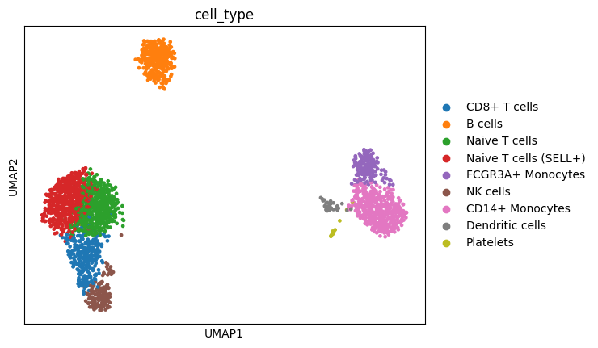
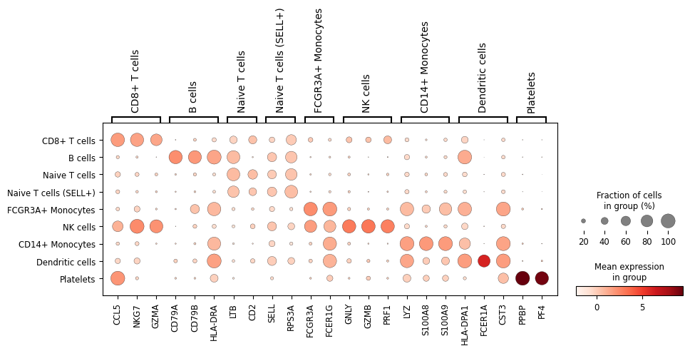

# Single-Cell RNA-seq Analysis of Human Peripheral Blood Immune Cells

## Overview

This project performs a full single-cell RNA sequencing (scRNA-seq) analysis pipeline on human Peripheral Blood Mononuclear Cells (PBMCs), starting from raw gene expression counts and ending with fully annotated immune cell populations. The goal was to independently learn and apply the standard computational workflow used in single-cell genomics research: quality control, normalization, dimensionality reduction, unsupervised clustering, and biological interpretation via marker gene analysis.

Starting with 2,700 cells and ~32,700 genes, the analysis identifies **9 distinct immune cell populations**, each validated using both canonical marker genes and unbiased statistical marker discovery.

## Motivation

Single-cell genomics is one of the fastest-growing areas in computational biology, reshaping research in immunology, cancer biology, neuroscience, and developmental biology by allowing researchers to study gene expression at the resolution of individual cells rather than bulk tissue averages. I built this project independently to learn the field's standard analytical pipeline hands-on, using it as a foundation for pursuing graduate research in computational/systems biology, particularly at the intersection of computational and experimental (wet-lab) approaches.

## Dataset

- **Name:** PBMC3k
- **Source:** 10x Genomics, accessed via scanpy's built-in example datasets (scanpy.datasets.pbmc3k())
- **Description:** ~2,700 human peripheral blood mononuclear cells, with expression measured across ~32,700 genes per cell
- **Why this dataset:** PBMC3k is the standard benchmark dataset used across the single-cell field for learning and validating analysis pipelines, which allows direct comparison of my results against established, published findings

## Methods

The analysis was performed in Python using scanpy, the standard toolkit for single-cell analysis, along with its underlying dependencies (anndata, pandas, numpy, matplotlib).

**1. Quality Control**
Per-cell metrics were calculated, including number of genes detected, total RNA counts, and percentage of mitochondrial gene expression (a standard indicator of cell damage/death). Distributions were visualized using violin plots, and thresholds were set based on the observed data (removing cells with >2,500 genes detected, indicative of possible doublets, and >5% mitochondrial content, indicative of damaged cells). This reduced the dataset from 2,700 to 2,638 high-quality cells.

**2. Normalization**
Each cell's total counts were normalized to a common scale (target sum of 10,000) to correct for technical variation in sequencing depth between cells, followed by a log(x+1) transformation to stabilize variance across the highly skewed distribution of gene expression values.

**3. Feature Selection**
The top 2,000 highly variable genes were identified and retained for downstream analysis, focusing the analysis on genes most likely to reflect real biological differences between cell types rather than technical noise or housekeeping gene expression. A full-gene backup (adata.raw) was preserved for later marker gene lookup and differential expression analysis.

**4. Dimensionality Reduction**
Data was scaled (zero-centered, unit variance) and reduced to 50 principal components using PCA, condensing the 2,000-gene expression profile of each cell into a smaller set of components capturing the majority of biologically meaningful variation.

**5. Clustering**
A k-nearest-neighbors graph (10 neighbors, using the first 40 principal components) was constructed between cells, and the Leiden algorithm was applied to detect 9 distinct clusters of transcriptionally similar cells.

**6. Visualization**
UMAP (Uniform Manifold Approximation and Projection) was used to project the 50-dimensional PCA space into two dimensions for visualization, preserving local similarity relationships between cells.

**7. Cell Type Annotation**
Clusters were annotated using two complementary approaches:
- Canonical marker gene lookup: Known immune cell markers (CD3D/T cells, CD79A/B cells, CD14/monocytes, NKG7/NK cells) were checked against cluster-specific expression.
- Unbiased marker discovery: The Wilcoxon rank-sum test (scanpy.tl.rank_genes_groups) was used to statistically identify genes most distinctively expressed in each cluster, without prior assumptions, allowing identification of populations not covered by the initial canonical marker list.

## Results

Nine distinct immune cell populations were identified and annotated:

| Cluster | Cell Type | Key Marker Genes | Cell Count |
|---------|-----------|-------------------|------------|
| 0 | CD8+ T cells | CCL5, NKG7, GZMA | 299 |
| 1 | B cells | CD79A, CD79B, HLA-DRA | 342 |
| 2 | Naive T cells | LTB, CD2 | 549 |
| 3 | Naive T cells (SELL+) | SELL, RPS3A | 607 |
| 4 | FCGR3A+ Monocytes | FCGR3A, FCER1G | 169 |
| 5 | NK cells | GNLY, GZMB, PRF1 | 153 |
| 6 | CD14+ Monocytes | LYZ, S100A8, S100A9 | 468 |
| 7 | Dendritic cells | HLA-DPA1, FCER1A, CST3 | 36 |
| 8 | Platelets | PPBP, PF4 | 15 |

**UMAP of annotated cell types:**

**Dot plot validating marker gene specificity across clusters:**

The dot plot confirms strong diagonal specificity — each cell type's canonical markers are most strongly and broadly expressed within their own cluster, with biologically expected overlap between closely related populations (e.g., cytotoxic markers shared between CD8+ T cells and NK cells).

## Discussion / Limitations

- Dendritic cells and Platelets were the smallest identified populations (36 and 15 cells respectively) — consistent with their known low natural abundance in peripheral blood.
- Some marker gene overlap was observed between related lymphocyte subtypes (e.g., NK and CD8+ T cell cytotoxic markers), reflecting genuine shared biology between these cell types rather than a labeling error.
- This analysis used a single, well-characterized reference dataset; results would benefit from validation against an independent PBMC dataset or comparison to published cell type proportions.
- Cluster resolution (number of clusters detected) is sensitive to parameter choices (e.g., number of neighbors, number of PCs used) — the current parameters follow standard community defaults but were not systematically optimized.

## What I'd Do Next

- Perform differential expression analysis between specific cell type pairs (e.g., naive vs. SELL+ T cell subsets) to characterize their functional differences more precisely
- Extend the analysis using a dataset from a disease state (e.g., an infection or cancer PBMC dataset) to explore how cell type proportions and gene expression shift under physiological stress
- Explore spatial transcriptomics data, which adds physical tissue location information on top of single-cell expression data

## Requirements

See requirements.txt for exact package dependencies. Install with the command: pip install -r requirements.txt

## How to Run

1. Open the notebook (pbmc_analysis.ipynb) in Google Colab or Jupyter
2. Run all cells in order (installs scanpy automatically in the first cell)
3. No external files needed — dataset loads automatically via scanpy.datasets.pbmc3k()

## Tools & Libraries

- Python 
- scanpy — single-cell analysis toolkit
- anndata — underlying data structure for single-cell data
- pandas, numpy — data handling
- matplotlib — visualization

## Author

Anza Muzaffar 
